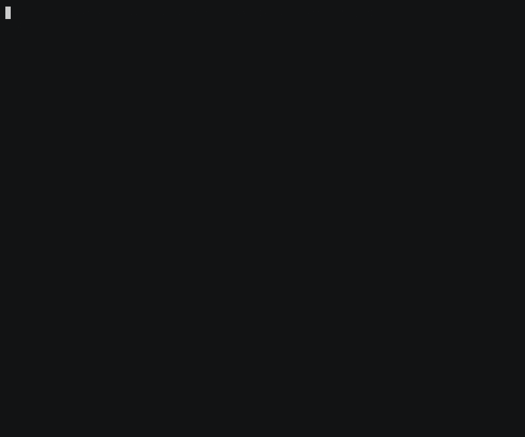

# lo-agent

`lo` is an agent harness built around the advantages local and self-hosted LLMs
have over frontier APIs: determinism & exact replay, spec-driven grammar skills,
a token-level logit pipeline, uncertainty-aware control flow, KV-cache-aware
tree search, and free-tokens compute scaling.

You need Python ≥ 3.12 and any OpenAI-compatible model server — llama.cpp,
vLLM, LM Studio, or Ollama, on this machine or another box. No local GPU
required; the model runs wherever your server does.

## See it, don't take our word for it

Every clip below is a live run on a local Qwen3.6-27B — no narration, no
"✓ it worked" labels. You watch the behavior happen.

**Determinism & exact replay** — the same prompt and seed, twice. Read the
reasoning trace and the final sentence: character-for-character identical. A
frontier best-effort seed drifts; a local one is reproducible and `lo replay`
verifies it.


**Spec-driven grammar skills** — "list exactly seven" and then *count them*.
Invalid tokens are masked at decode time, so the output is in the grammar's
language with probability 1. Frontier models miscount; this one can't.


**Token-level logit pipeline (anti-slop)** — "tapestry" is the model's favorite
slop word. Ban it, and when it starts to form lo rewinds the KV cache and
re-samples with its first token masked. Same prompt, same seed — you watch
"radiant tapestry" become "radiant mosaic" after one rewind, still fluent.


**Uncertainty-aware control flow** — five samples of each question (free, on
prefix cache). A question with one answer: they agree, trust it. An open one:
they scatter, the model is guessing. Consensus *is* the confidence — you read
the spread, not a number.


**KV-cache tree search & free tokens** — fork one prompt into four candidates
(the shared prefix is decoded once, so the forks are nearly free), then a
verifier picks the best. You pick nothing; you watch it pick. A frontier API
can't fork a cache — it would bill all four prompts in full.


**Activations (Rung 6)** — reading and steering the residual stream itself — are
shown in the [J-Lens](#j-lens--read-and-steer-the-residual-stream-access-ladder-rung-6)
section below.

## Installation

### One-liner

```bash
curl -fsSL https://raw.githubusercontent.com/IMJONEZZ/lo-agent/main/install.sh | bash
```

Installs `lo` with uv (bootstrapping uv itself if needed), verifies it runs,
and climbs the capability ladder on the way out. No sudo; nothing outside
`~/.local` and uv's own directories. Re-run it any time to upgrade.

### uv

```bash
uv tool install "git+https://github.com/IMJONEZZ/lo-agent"
```

This puts the `lo` command in `~/.local/bin` — run `uv tool update-shell` if
that isn't on your PATH yet.

### Homebrew

```bash
brew tap IMJONEZZ/lo-agent
brew install lo-agent
```

(The first `brew tap`/`install` from a personal tap asks you to trust
`imjonezz/lo-agent` — that prompt is expected; confirm to proceed.)

### Build from source

```bash
git clone https://github.com/IMJONEZZ/lo-agent
cd lo-agent
uv sync            # creates .venv/ and installs everything
uv run lo --help   # run from the project venv
```

To put a from-source `lo` on your PATH instead (editable — tracks your
checkout): `uv tool install -e .`

## Quickstart

```bash
# 0. Have a model server running. Any OpenAI-compatible endpoint works, e.g.:
llama-server -m your-model.gguf --port 8080     # or vLLM / LM Studio / Ollama

# 1. Find it and drop straight into the TUI
lo quickstart                                   # scans :8080 :8000 :1234 :11434
lo quickstart --url http://<host>:<port>        # server on another machine

# 2. Make the endpoint stick so you never type --url again
lo config set url http://localhost:8080         # flag > env > config precedence

# 3. Or drive it from the CLI
lo run "Use the calculator tool to compute 17*23 plus 100."

# Something not working? Diagnose it — each failure comes with a fix:
lo doctor
```

`lo probe` reports what your server unlocked (see [capability tiers](#architecture-capability-tiers)),
`lo proxy` puts the logit pipeline in front of any client, and the
[Usage](#usage) section has the full command reference.

## What's inside

The pillars, roughly in dependency order:

1. Substrate — client, capability prober, event log, bit-identical replay, crash resume
2. Spec-driven skills (grammar IR → GBNF/Lark/JSON-schema/validate-retry), logit
   pipeline (sampler zoo, bias profiles, think-budget forcing), logprob signals + step policies
3. Tree state with fork(), slot snapshots, best-of-N with verifiers, beam search,
   anti-slop phrase bans with backtracking
4. FTS5 memory, bootstrap-few-shot + instruction-search optimizers (DSPy optional:
   `--extra dspy`), background cognition (consolidate / reflect / induce)
5. Native in-process backend (`--extra native`): custom sampling loop with arbitrary
   logit processors, exact anti-slop via KV-cache rewind, classifier-free guidance with
   negative prompts, contrastive decoding, CAA activation steering, LoRA hot-swap,
   weight-level fine-tuning
6. Guardrails (after [forge](https://github.com/antoinezambelli/forge), MIT): rescue
   parsing of tool calls from free text, corrective nudges with channel separation
   (format errors → user, tool errors → tool), error budgets, required-step /
   terminal-tool / prerequisite enforcement with escalating nudges, and priority-based
   context compaction. On by default in `lo run`; tune with `--required-steps`,
   `--terminal-tool`, `--context-budget`, or `--no-guardrails`.
7. **Proxy mode** — the front door for any client. `lo proxy` serves both the
    OpenAI chat-completions API and the Anthropic Messages API (`/v1/messages`, so
    Claude Code works) in front of any upstream, applying the logit pipeline
    (grammar skills, sampler zoo, bias profiles, think budgets, anti-slop) and
    guardrails (rescue parsing, internal retry nudges, schema validate-and-retry)
    transparently. Every proxied call is event-logged and `lo replay`-able.
8. **TUI** — `lo tui` (Textual). A live runs table, a transcript view rendered
    straight from the event log (assistant panels with reasoning, tool calls,
    per-call seed/latency/confidence, guardrail rescues and nudges), and a task
    launcher. The TUI is a pure read-side consumer of the log, so runs started
    here, via `lo run` in another terminal, or through the proxy
    (`lo tui --db proxy.db`) all stream in live. `ctrl+r` replays the
    selected run against the server and reports whether it's bit-identical.

## J-Lens — read and steer the residual stream (access-ladder Rung 6)

Frontier APIs hand you the token distribution at most. A local GGUF has more
underneath it: the **residual stream** itself. `lo lens` pairs a small
activation sidecar with your model so you can *watch* what the model is thinking
layer by layer — the [Jacobian lens](https://transformer-circuits.pub/2026/workspace)
from Anthropic's global-workspace work — and then **steer, ablate, or swap**
concepts mid-generation. No labels claiming it worked; you watch the sentence
change:



*Live on a quantized Qwen3.6-27B (MTP): the lens shows ' Euro' winning at the
output while ' euro'/' lira' contend in the workspace band; then adding the
' yen' direction to the residual stream makes the same prompt answer "yen", and
ablating ' Euro' removes it entirely — the model stays fluent throughout.*

```bash
# on the model box (needs the GGUF + a C++ toolchain; builds the sidecar once):
lo lens up --llama-server http://127.0.0.1:8080     # → lens service on :8092
lo lens fit --model model.gguf --corpus wikitext:100 -o lens.gguf   # optional; sharper readouts

# from anywhere:
lo config set lens_url http://<model-box>:8092
lo lens gen "…the currency of Italy is the" --steer ' yen' --alpha 3   # A/B, baseline vs steered
lo tui                                                # ctrl+j opens the live heatmap tab

# back on the model box, when you're done — frees the model's RAM/VRAM + ports:
lo lens down
```

`lo lens up` runs in the foreground and stops its sidecar on exit; `-d`/`--detach`
runs it in its own session instead, so it survives the terminal (log:
`~/.lo/jlens/lens.log`). Either way `lo lens down` stops it — it reads the
run-state file `up` writes and falls back to whoever holds the ports, so an
orphan from a `kill -9` is still reapable. It never stops a sidecar `up` merely
reused, unless `--force`.

In the TUI, `ctrl+j` opens the lens on **the conversation you are viewing**
(after `/new` it asks for text instead), and `n` generates a continuation
through the lens so you watch the residual stream as tokens are produced rather
than re-reading finished text. While a slice computes, the tab shows what text
it is reading, a running elapsed count, and — once it has one request's timings
— an up-front estimate; `esc` cancels an in-flight slice (a second `esc`
closes). `e` analyzes text you type, `V` pushes the current intervention set to
the chat so your next real turn is steered, and `?` documents every key. The
header names the readout quality (`identity lens (unfitted)` until you
`lo lens fit` one). With no conversation yet it says so rather than analyzing
filler.

A sidecar started without `--n-gpu-layers` runs the model **on CPU** — a
27B-class model reads out at several seconds per token there, so slices and
generation take minutes (`up` now warns about this). Offload with
`lo lens up --n-gpu-layers N` if the GPU has headroom.

It reaches your **existing** server three ways, no rewrite: a llama.cpp
**control vector** (`lo lens export cvec …` → one relaunch flag), an
**abliterated GGUF** (`lo lens export abliterate …` → a new model any server
loads, incl. LM Studio/Ollama), or an **`LD_PRELOAD` shim** (`lo lens shim …` →
live edits inside your own `llama-server`, one restart):


*The shim interposes context creation in a stock llama.cpp program and edits
the residual stream mid-graph — the token ids it samples change, no fork of
llama.cpp, one env var.*

vLLM/safetensors get an exact causal lens via `lo lens fit --hf`. Everything
gates on a capability probe and degrades honestly. Needs the `lens` extra:
`uv sync --extra lens`.

## TUI

```bash
lo tui                  # watch + launch agent runs (lo.db)
lo tui --db proxy.db    # watch live proxy traffic
```

Type a task in the bottom input and press Enter to launch an event-sourced
agent run; the transcript follows it live. Agent flags (`--required-steps`,
`--terminal-tool`, `--no-guardrails`, `--context-budget`, `--max-steps`) work
exactly as they do for `lo run`.

In the `^t` history sidebar, `/` filters conversations and `r` renames the
highlighted one (titles show up in `lo runs` too). `/inspect` opens per-model-call
stats — timing, tokens, logprob confidence, finish reason — straight from the
event log. `/help` lists everything.

The TUI is a thin client of a session server (started embedded by default).
You can also run that server on its own and attach from anywhere:

```bash
lo serve --port 8099        # headless session server (HTTP + SSE bus)
lo tail --task "check CI"   # start + follow a session from another terminal
lo daemon start             # keep `lo serve` running in a detached tmux
```

## Proxy

```bash
lo proxy --url http://localhost:8080 --port 8088
# then point opencode/aider/Continue at http://localhost:8088/v1
# or Claude Code / Anthropic SDKs at http://localhost:8088 (/v1/messages)
```

Server-wide defaults via flags (`--skill`, `--samplers '{"min_p":0.05,"dry":{}}'`,
`--bias-profile`, `--banned-phrases delve,tapestry`, `--think-budget 300`); any
request can override per-call with a `harness` extension object:

```json
{"messages": [...],
 "harness": {"skill": "sql_select", "samplers": {"min_p": 0.05},
             "think_budget": 200, "banned_phrases": ["delve"]}}
```

`GET /health` reports the upstream's probed capability tier. Buffered SSE is
emitted for `stream: true` in both dialects.

## Architecture: capability tiers

One OpenAI-compatible client + a capability prober + thin per-server adapters
(`llama.cpp`, `vLLM`, generic). Features unlock by verified tier:

| Tier | Requires | Unlocks |
|------|----------|---------|
| 0 | any OpenAI-compat endpoint | agent loop, event traces, validate-and-retry structure |
| 1 | + seed (verified live), logprobs | bit-identical replay, uncertainty signals |
| 2 | + grammar, logit_bias, sampler params, raw completion | CFG skills, sampler zoo, think-budget control |
| 3 | + KV/slot snapshots or parallel n | cheap tree search, fork/backtrack |
| 4 | in-process model **or a paired J-Lens service** | activation read/steer, LoRA, arbitrary logit processors |

Tier 4 is reached two ways: the in-process native backend, **or** a Jacobian-lens
service paired with a GGUF endpoint — activation access over HTTP (see below).

## Usage

```bash
# What can this server do? (probes seed determinism with live test requests)
lo probe --url http://localhost:8080

# Run an agent task (event-sourced; every model call logged with its seed)
lo run "Use the calculator tool to compute 17*23 plus 100."

# List runs (filter/search/JSON), resume a crashed run, verify a bit-identical
# replay, or diff two runs' transcripts (a replay against its original)
lo runs --status failed --since 2h --search banana --json
lo resume <run-id>
lo replay <run-id>
lo diff <run-id> <run-id>

# Grammar skills: guaranteed-valid output, server-constrained where possible
lo skill list
lo skill sql_select "names of users older than 30; table users(name, age)"

# Background cognition: summarize runs into memory, reflect on failures,
# induce draft skills from recurring output shapes; then query memory
lo background
lo recall "sql users"
```

Tip: start llama.cpp with `--slot-save-path /some/dir` to unlock true KV-state
snapshots (tree forks restore exactly instead of relying on prefix cache).

`--url/--model/--db` or `LO_BASE_URL`/`LO_MODEL`/`LO_DB` select the
endpoint and event-log database (default `lo.db`). Set them once instead with
`lo config set url http://…` (`~/.lo/config.json`, shared with the TUI);
precedence is flag > env > config.

More setup helpers:

```bash
lo doctor                    # diagnose: config, server, model, event log, sandbox
lo completion bash           # tab completion — eval "$(lo completion bash)" (zsh/fish too)
lo --version
```

## Layout

```
src/local_harness/
├── inference/   # OpenAI-compat client, capability prober, server adapters
├── events/      # append-only SQLite event log, deterministic replay
├── skills/      # grammar IR (EBNF -> GBNF/Lark/validator), TOML skills, execution
├── logits/      # pipeline stages: samplers, bias, grammar, think-budget,
│                # anti-slop (HTTP emulation), CFG/contrastive guidance (native)
├── guardrails/  # rescue parsing, nudges, step enforcement, error budgets
├── signals/     # logprob confidence metrics, step policies (resample/escalate/ask)
├── tree/        # conversation tree + fork, slot snapshots, best-of-N, beam
├── agent/       # event-sourced agent loop (resume from any crash), tools, FTS5 memory
├── optimize/    # bootstrap few-shot, instruction search, LoRA fine-tuning, DSPy adapter
├── background/  # idle-time cognition: consolidate, reflect, induce skills
├── native/      # Tier-4 in-process backend, activation steering, LoRA hot-swap
├── proxy/       # OpenAI + Anthropic API front door with pipeline + guardrails
├── tui/         # Textual app: live run viewer + task launcher over the event log
├── sim/         # user-simulation journeys: scenario DSL + PTY driver (lo simulate)
└── cli/         # lo quickstart|run|tui|serve|proxy|runs|replay|diff|config|doctor|…
```

## Tests

```bash
uv run pytest
```

Unit tests run against mock servers (no GPU needed), including user-simulation
journeys that drive the real TUI over the real session server. Two opt-in tiers
go further: `-m pty` (a real PTY subprocess) and `-m live` (a real model —
`LO_LIVE_URL=http://<host>:8080 uv run pytest -m live`), or point any journey at
a live box with `lo simulate <name|all> --url http://<host>:8080`.

Live verification against a running llama.cpp server: `lo probe`, then `run` +
`replay` — replay exits 0 only if the transcript hash matches.

## Uninstall

```bash
curl -fsSL https://raw.githubusercontent.com/IMJONEZZ/lo-agent/main/install.sh | bash -s -- --uninstall
```

Removes `lo` however it was installed (uv tool and/or brew) and tells you what
it did. By hand instead:

```bash
uv tool uninstall lo-agent                              # one-liner / uv installs
brew uninstall lo-agent && brew untap IMJONEZZ/lo-agent # brew installs
```

Your data is never touched by an uninstall: `~/.lo/` holds config and
memory (`rm -rf ~/.lo` if you want it gone), and each project keeps its
event log in a local `lo.db`.

## License

lo-agent is **source-available**, not open source. See [LICENSE](LICENSE) for
the full terms — the short version:

- **Individuals** may use, run, and freely customize lo-agent for personal,
  non-commercial use.
- **Organizations** (any company, non-profit, club, or commercial use — even a
  solo freelancer) may run it **as-is for free**, including commercially, as
  long as the lo-agent branding stays visible.
- **Customizing** anything — code, behavior, colors, or branding — on behalf of
  an organization requires an **enterprise license**. Reach out to
  Chris Brousseau at chrisbrousseau304@gmail.com to arrange one.
